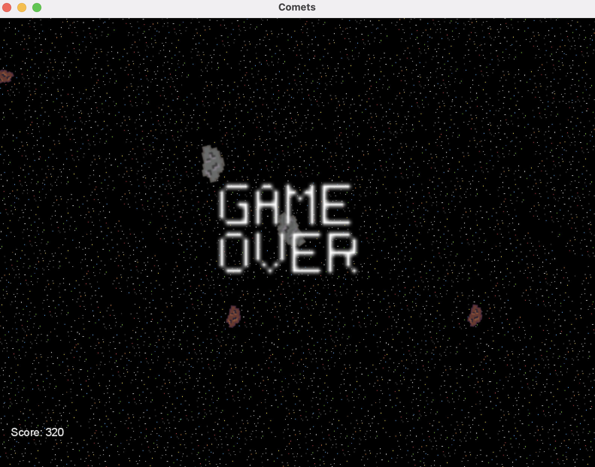

# Comets

## Project Overview
Love the old school Asteroids game, but out of quarters? You've come to the right place. Comets is a space shoot em up game that lets you launch into space and blast through rocks big and small to rack up the highest score possible.

Space starts out pretty safe, with only minor debris to blow up and dodge. As you float, blast and glide through the colorful galaxy, the challenge picks up to be an avalanche of danger orbiting your way.

Space is a scary place, and while your score can soar as high as your purple rocket ship, eventually, your shield will give out from the pummeling and you'll have to launch a new adventure to see if you can spin through space a little bit longer next time!

## Getting Started
TODO - FINISH, FIGURE OUT PACKAGING ISSUES

### Installing

### Run the game
-- DETAIL ON HOW TO LAUNCH JAR OR EXECUTABLE --

This will launch the opening game window:

## How to Play
Press the **S key** on your keyboard to start the game:

Use the following controls on the keyboard to destroy comets and asteroids and rack up points:

* **Up Arrow** - Accelerate ship forward
* **Left Arrow** - Rotate ship direction left
* **Right Arrow** - Rotate ship direction right
* **Down Arrow** - Decelerate ship
* **Space Bar** - Shoot lasers

As you successfully destroy the the space rocks around you, your score will increase. You can check your score in the bottom left corner of the game screen:

Points are assessed as follows:

 **Asteroids** - 10 points
 **Comets** - 20 points

Once you destroy all of the comets and asteroids, more will spawn taking you to the next level of challenge. If a comet or asteroid hits you, you will lose shield power:

Eventually, your shield will break down after enough hits, giving you one last chance to destroy as many space rocks as possible!

If you are hit with no shield, your ship will crash ending the game:

-- NEED TO INCLUDE RESTART OPTION --

Relaunch to try again and beat your high score!
